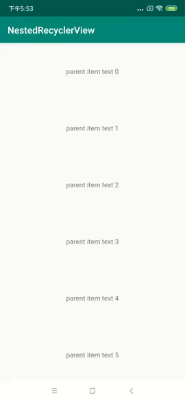
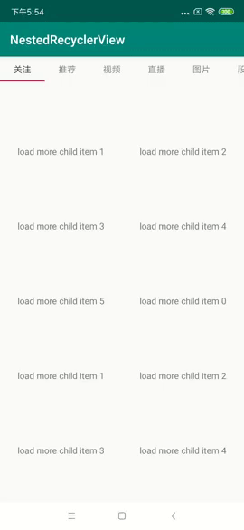

## NestedRecyclerView

[仿淘宝、京东首页，通过两层嵌套的RecyclerView实现tab的吸顶效果](https://juejin.im/post/5d5f4cfcf265da03e61b18b8)

### 现已提供Java和Kotlin两种版本，具体可查看项目代码。

### 项目效果展示：





### 背景
我们自己的商城的首页和淘宝、京东首页效果类似，上面为配置数据，中间是各种分类频道，下面是商品流数据，商品流部分支持左右横滑，分类频道是支持吸顶的。

最早是用CoordinatorLayout实现，在AppBarLayout下放一个RecyclerView，下面部分则放一个ViewPager，ViewPager里则是商品流的RecyclerView，CoordinatorLayout支持设置他的某个子View吸顶，这样基本能满足需求。

在[CoordinatorLayoutFix](https://github.com/JasonGaoH/CoordinatorLayoutFix) 中修复了一些体验问题，基本可以让这种实现满足商业性的项目需求。

### 调研

在调用了淘宝和京东的实现发现可以通过两层RecyclerView来实现。


可以看到京东首页的实现是上面这样的。

### 大致实现方式

- 外部RecyclerView为ParentRecyclerView，将需要吸顶的悬浮效果的TabLayout和ViewPager作为ParentRecyclerView的一个item。
- 内部RecyclerView为ChildRecyclerView,ParentRecyclerView和ChildRecyclerView相互协调:
  - 当ParentRecyclerView滚动到底部的时候，让ChildRecyclerView去滚动。
  - 当ChildRecyclerView滚动到顶部的时候，让ParentRecyclerView去滚动。

#### 利用canScrollVertically这个方法来判断当前View是否滚动到底或者是否滚动到顶。

```java
//ParentRecyclerView
   private boolean isScrollEnd() {
        //RecyclerView.canScrollVertically(1)的值表示是否能向上滚动，false表示已经滚动到底部
        return !canScrollVertically(1);
    }

```

```java
//ChildRecyclerView
 boolean isScrollTop() {
        //RecyclerView.canScrollVertically(-1)的值表示是否能向下滚动，false表示已经滚动到顶部
        return !canScrollVertically(-1);
    }
```
#### ParentRecyclerView和ChildRecyclerView需要拿到对方的引用，以便能够协调滚动。

目前ChildRecyclerView是直接通过往上查找的方式来进行的。而ParentRecyclerView需要通过ViewPager来找到当前显示的是哪一个ChidRecyclerView。

```java
//ChildRecyclerView
private ParentRecyclerView findParentRecyclerView() {
        ViewParent parentView = getParent();
        while (!(parentView instanceof ParentRecyclerView)) {
            parentView = parentView.getParent();
        }
        return (ParentRecyclerView)parentView;
    }
```

```java
//ParentRecyclerView
   private ChildRecyclerView findNestedScrollingChildRecyclerView() {
        if(getAdapter()!= null && (getAdapter() instanceof MultiTypeAdapter)) {
            return ((MultiTypeAdapter)getAdapter()).getCurrentChildRecyclerView();
        }
        return  null;
    }
```

#### 处理fling效果
在RecyclerView的onScrolled记录总的偏移，当ParentRecyclerView滑动到底部的时候，将多余的需要消费的总偏移转换成加速度，从而交给子View去Fling，反之，类型。

#### 处理嵌套滚动
如果不处理嵌套滚动，在某些边界场景下，当我们滑动不松手时会出现无法滑动的问题。

### 另外 
> 新增Tab折叠动画


关于
--

博客：[https://blog.csdn.net/H_Gao](https://blog.csdn.net/H_Gao)

邮箱：532294580@qq.com

License
--
Copyright 2018 JasonGaoH

Licensed under the Apache License, Version 2.0 (the "License"); you may not use this file except in compliance with the License. You may obtain a copy of the License at

http://www.apache.org/licenses/LICENSE-2.0

Unless required by applicable law or agreed to in writing, software distributed under the License is distributed on an "AS IS" BASIS, WITHOUT WARRANTIES OR CONDITIONS OF ANY KIND, either express or implied. See the License for the specific language governing permissions
